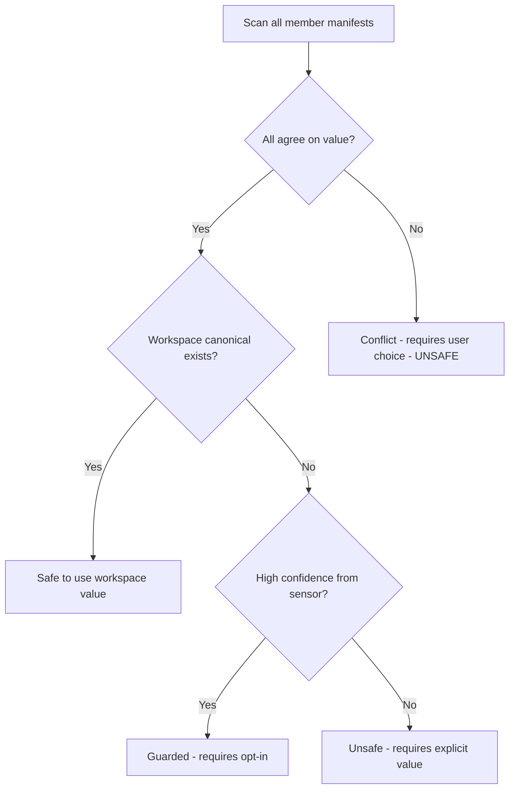
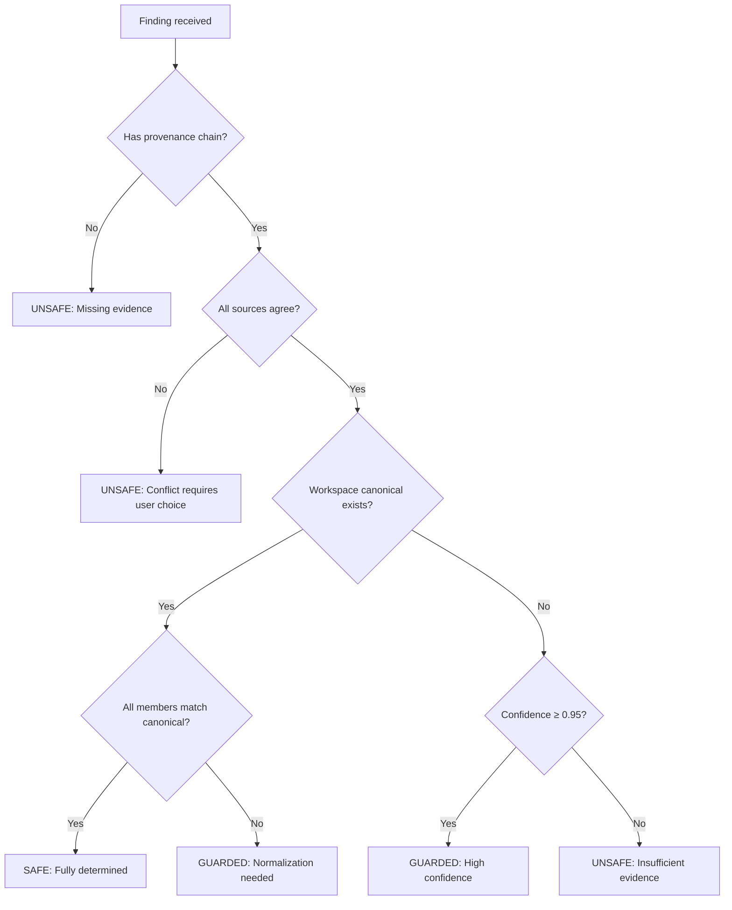

# No Guessing Policy

> **Version**: 1.0  
> **Since**: v0.4.0 (Evidence-Rich Unsafe Reduction)  
> **Status**: Normative

This document formalizes buildfix's core invariant: **values must be derived from repo-local truth OR provided explicitly by the user**. This policy is non-negotiable and forms the foundation of buildfix's trustworthiness.

---

## 1. Introduction

### What is the "No Guessing" Policy?

The "No Guessing" policy is buildfix's commitment to never invent, assume, or default values when generating repair operations. Every value in a plan must have a clear provenance—a documented source that explains where it came from and why it's correct.

### Why is it Important?

buildfix is a **torque wrench**, not a helpful assistant. Its job is to apply precise, deterministic transformations to your workspace, not to make suggestions or "best effort" changes. When buildfix modifies your `Cargo.toml`, you should be able to trust that:

1. The change is correct (not just plausible)
2. The change is reversible (fully documented in artifacts)
3. The change is auditable (evidence chain exists)

### How Does it Protect Users?

| Without No Guessing | With No Guessing |
|---------------------|------------------|
| "I think you meant edition 2021" | "All 15 crates use edition 2021 from workspace.package.edition" |
| "Let me pick a version for you" | "Version 1.2.3 comes from the path dep's Cargo.toml line 5" |
| "This looks like an unused dep" | "cargo-machete reported this dep as unused with 100% confidence" |
| Silent defaults | Explicit provenance chains |

---

## 2. Core Principle

```
buildfix NEVER invents values.

All values must be:
1. Derived from repo-local truth (files, lockfile, workspace metadata), OR
2. Provided explicitly by the user via CLI arguments or configuration

If neither condition is met, the operation is classified as UNSAFE
and will not be applied without explicit user parameters.
```

This principle is enforced at the fixer layer. Any fixer that attempts to generate an operation without satisfying one of these conditions is in violation of the policy and should be considered a bug.

### What Counts as "Inventing"?

| Inventing (NOT ALLOWED) | Derived (ALLOWED) |
|-------------------------|-------------------|
| Defaulting to `edition = "2021"` | Reading `workspace.package.edition` from root manifest |
| Picking the "latest" version | Extracting version from the dependency's `Cargo.toml` |
| Assuming a dep is unused | Receiving explicit unused-finding from cargo-machete |
| Guessing MSRV from rustc version | Reading `rust-version` from manifest or rustc error |
| Inferring license from directory name | Reading `license` field from manifest |

---

## 3. Sources of Truth

buildfix recognizes the following as valid sources of truth:

### 3.1 Cargo.toml (Package Manifests)

The primary source of package metadata:

```toml
[package]
name = "my-crate"
version = "0.1.0"
edition = "2021"
rust-version = "1.70"
license = "MIT OR Apache-2.0"

[dependencies]
serde = { version = "1.0", features = ["derive"] }
```

**Derivable values**: package name, version, edition, MSRV, license, dependency specifications

### 3.2 Cargo.lock (Lockfile)

The resolved dependency graph provides canonical versions:

```toml
[[package]]
name = "serde"
version = "1.0.195"
source = "registry+https://github.com/rust-lang/crates.io-index"
```

**Derivable values**: resolved versions, dependency tree structure, checksums

### 3.3 Workspace Manifest (Root Cargo.toml)

Shared configuration that member crates inherit:

```toml
[workspace]
resolver = "2"
members = ["crates/*"]

[workspace.package]
edition = "2021"
rust-version = "1.70"
license = "MIT OR Apache-2.0"

[workspace.dependencies]
serde = { version = "1.0" }
```

**Derivable values**: workspace-level edition, MSRV, license, shared dependency versions

### 3.4 Source Files

Rust source files can provide evidence via rustc JSON diagnostics:

```json
{
  "message": "edition 2018 is deprecated",
  "spans": [{"file": "src/lib.rs", "line": 1}]
}
```

**Derivable values**: actual edition in use, MSRV requirements from compilation errors

### 3.5 Receipts (Sensor Findings)

Sensor receipts provide the primary evidence for fix operations:

```json
{
  "check_id": "cargo.normalize_edition",
  "data": {
    "edition": "2021",
    "workspace_edition": "2021",
    "all_crates_agree": true,
    "provenance": {
      "method": "manifest_analysis",
      "evidence_chain": [
        {"source": "workspace.package.edition", "value": "2021", "validated": true}
      ]
    }
  }
}
```

**Derivable values**: findings, confidence scores, evidence chains, tool-validated facts

---

## 4. Evidence-Based Safety Promotions

v0.4.0 introduces **evidence-rich receipts** that enable safer classifications without violating the No Guessing policy. The key insight is that **sensors report certainty, not buildfix guessing**.

### 4.1 Confidence Scores

Sensors can report their confidence in a finding:

```json
{
  "check_id": "cargo.unused_dep",
  "confidence": 0.95,
  "data": {
    "dep_name": "chrono",
    "unused_in": ["src/lib.rs", "src/main.rs"]
  }
}
```

- **High confidence (≥0.95)**: Sensor has strong evidence, buildfix can consider guarded promotion
- **Medium confidence (0.7-0.94)**: Sensor has some evidence, requires validation
- **Low confidence (<0.7)**: Sensor is uncertain, treat as unsafe

**Important**: The confidence comes from the sensor, not buildfix. buildfix does not second-guess or adjust confidence scores.

### 4.2 Provenance Chains

Every finding should include a provenance chain showing where values came from:

```json
{
  "provenance": {
    "method": "workspace_consensus",
    "evidence_chain": [
      {"source": "crates/foo/Cargo.toml:package.edition", "value": "2021"},
      {"source": "crates/bar/Cargo.toml:package.edition", "value": "2021"},
      {"source": "Cargo.toml:workspace.package.edition", "value": "2021", "canonical": true}
    ]
  }
}
```

This allows buildfix to:
1. Verify the value exists in multiple places
2. Identify the canonical source
3. Detect conflicts before applying changes

### 4.3 Workspace Consensus

When all workspace members agree on a value, buildfix can safely normalize:



**Key**: Consensus is derived from actual crate values, not invented by buildfix.

### 4.4 Tool Agreement

When multiple sensors confirm the same finding, confidence increases:

| Sensor 1 | Sensor 2 | Agreement Level | Classification Impact |
|----------|----------|-----------------|----------------------|
| cargo-machete: unused | cargo-udeps: unused | Full agreement | Safe to remove |
| cargo-machete: unused | (no data) | Single source | Guarded (requires `--allow-guarded`) |
| cargo-machete: unused | cargo-udeps: used | Conflict | Unsafe (requires user decision) |

**Key**: Agreement is detected, not assumed. buildfix requires explicit receipts from both tools.

---

## 5. Examples

### 5.1 Good: Evidence-Based Safe Operation

```json
{
  "check_id": "cargo.normalize_edition",
  "data": {
    "edition": "2021",
    "workspace_edition": "2021",
    "all_crates_agree": true,
    "provenance": {
      "method": "manifest_analysis",
      "evidence_chain": [
        {"source": "workspace.package.edition", "value": "2021", "validated": true},
        {"source": "crates/foo/Cargo.toml:3", "value": "2021"},
        {"source": "crates/bar/Cargo.toml:3", "value": "2021"}
      ]
    }
  }
}
```

**Classification**: **Safe**

**Reasoning**:
- Edition "2021" comes from `workspace.package.edition` (canonical source)
- All member crates already use this edition (consensus)
- Evidence chain shows exactly where the value was found
- No guessing required—value is fully determined by repo state

### 5.2 Good: Evidence-Based Guarded Operation

```json
{
  "check_id": "cargo.remove_unused_dep",
  "confidence": 0.95,
  "data": {
    "dep_name": "chrono",
    "crate": "my-crate",
    "provenance": {
      "method": "usage_analysis",
      "evidence_chain": [
        {"source": "cargo-machete", "finding": "unused", "confidence": 0.95},
        {"source": "src/lib.rs", "imports": [], "chrono_referenced": false}
      ]
    }
  }
}
```

**Classification**: **Guarded**

**Reasoning**:
- High confidence from sensor (95%)
- Evidence chain shows analysis method
- Single sensor source (would prefer multiple)
- Requires `--allow-guarded` to apply

### 5.3 Bad: Would Be Guessing (NOT ALLOWED)

```json
{
  "check_id": "cargo.normalize_edition",
  "data": {
    "edition": "2021"
  }
}
```

**Classification**: **Unsafe** (correctly blocked)

**Problem**:
- No evidence of where "2021" came from
- No workspace consensus data
- No provenance chain
- This is buildfix suggesting a value, which violates the policy

**Resolution**: The fixer must either:
1. Wait for an evidence-rich receipt, or
2. Require the user to provide `--edition 2021` explicitly

### 5.4 Bad: Missing Provenance (NOT ALLOWED)

```json
{
  "check_id": "cargo.set_msrv",
  "data": {
    "rust-version": "1.70"
  }
}
```

**Classification**: **Unsafe** (correctly blocked)

**Problem**:
- No provenance showing where "1.70" came from
- Could be a guess based on rustc version
- Could be copied from another crate
- No evidence this is the correct MSRV for this crate

**Resolution**: The receipt should include:
```json
{
  "provenance": {
    "method": "rustc_error_analysis",
    "evidence_chain": [
      {"source": "rustc:error", "message": "requires Rust 1.70 or newer"},
      {"source": "Cargo.toml:package.rust-version", "value": null, "note": "not set"}
    ]
  }
}
```

---

## 6. Safety Classification Decision Matrix

| Evidence Level | Classification | Auto-Apply | Example |
|----------------|----------------|------------|---------|
| Full consensus + validated canonical | **Safe** | Yes (default) | All crates agree, workspace canonical exists |
| High confidence (≥0.95) + provenance | **Guarded** | With `--allow-guarded` | Single high-confidence sensor finding |
| Medium confidence + partial provenance | **Guarded** | With `--allow-guarded` | Incomplete evidence but deterministic |
| Low confidence OR missing provenance | **Unsafe** | Never | Static analysis without confirmation |
| Conflict (multiple sources disagree) | **Unsafe** | Never | Two sensors report different values |
| No evidence (value suggested) | **Unsafe** | Never | Would require guessing |

### Decision Flowchart



---

## 7. Implementation Guidelines

For fixer authors, follow these guidelines to comply with the No Guessing policy:

### 7.1 Always Check for Evidence

```rust
// GOOD: Check for evidence before promoting
fn plan(ctx: &FixContext, repo: &RepoView, finding: &Finding) -> Vec<PlanOp> {
    let Some(provenance) = &finding.provenance else {
        // No evidence → unsafe, require user input
        return vec![PlanOp::unsafe_op(
            "cargo.normalize_edition",
            "No provenance chain provided. Use --edition to specify."
        )];
    };
    
    // Evidence exists → can classify based on quality
    let safety = classify_from_provenance(provenance);
    vec![PlanOp::with_safety(safety, /* ... */)]
}
```

### 7.2 Use Confidence and Provenance Fields

```rust
// GOOD: Use provided confidence, don't invent
fn classify_from_provenance(provenance: &Provenance) -> SafetyClass {
    match provenance.confidence {
        Some(c) if c >= 0.95 => SafetyClass::Guarded,
        Some(c) if c >= 0.70 => SafetyClass::Guarded,
        _ => SafetyClass::Unsafe,
    }
}
```

### 7.3 Fall Back to Unsafe When Evidence is Missing

```rust
// GOOD: Explicitly fall back to unsafe
fn determine_edition(finding: &Finding) -> EditionResult {
    match &finding.data.get("edition") {
        Some(value) if finding.provenance.is_some() => {
            EditionResult::Determined(value.clone())
        }
        Some(_) => {
            // Value present but no evidence → unsafe
            EditionResult::NeedsUserInput("edition not validated, use --edition")
        }
        None => {
            EditionResult::NeedsUserInput("no edition found, use --edition")
        }
    }
}
```

### 7.4 Never Assume or Default Values

```rust
// BAD: Defaulting violates the policy
fn determine_edition_bad() -> String {
    "2021".to_string() // ❌ This is guessing!
}

// GOOD: Require explicit input
fn determine_edition_good(cli_value: Option<&str>) -> Result<String, PlanError> {
    cli_value
        .ok_or(PlanError::MissingParameter(
            "edition",
            "Use --edition to specify the target edition"
        ))
        .map(|s| s.to_string())
}
```

---

## 8. User Control

Users retain full control over buildfix's behavior through several mechanisms:

### 8.1 Provide Explicit Values via CLI

When buildfix cannot determine a value safely, users can provide it explicitly:

```bash
# Provide edition explicitly
buildfix apply --edition 2021

# Provide MSRV explicitly
buildfix apply --msrv 1.70

# Provide license explicitly
buildfix apply --license "MIT OR Apache-2.0"
```

Explicit CLI values bypass the evidence requirement because the user is taking responsibility for correctness.

### 8.2 Override Safety Classifications via Policy

The policy file can promote or block operations:

```toml
# policy.toml
[policy]
# Allow all guarded operations without --allow-guarded
allow_guarded = true

# Block specific operations
[policy.deny]
"cargo-machete/unused_dep/*" = "manual review required"

# Promote specific operations (use with caution)
[policy.promote]
"cargo.normalize_edition" = "safe"  # Trust this check
```

### 8.3 Review Evidence in Plan Output

The `plan.md` artifact includes evidence chains for review:

```markdown
## Operation: Normalize Edition

**Target**: crates/foo/Cargo.toml  
**Classification**: Safe

**Evidence**:
- Source: workspace.package.edition
- Value: "2021"
- Consensus: 15/15 crates agree
- Validated: Yes

**Provenance Chain**:
1. Cargo.toml:5 → workspace.package.edition = "2021"
2. crates/foo/Cargo.toml:3 → package.edition = "2021" ✓
3. crates/bar/Cargo.toml:3 → package.edition = "2021" ✓
```

This allows users to verify the evidence before applying changes.

---

## 9. Related Documentation

- **[Safety Model](../safety-model.md)** — Overview of safe/guarded/unsafe classifications
- **[Exit Codes](../reference/exit-codes.md)** — Understanding policy blocks (exit code 2)
- **[Receipt Schema](../reference/receipt-schema.md)** — How to write evidence-rich receipts
- **[Determinism](determinism.md)** — Why byte-stable outputs matter
- **[Preconditions](preconditions.md)** — SHA256 verification before writes

---

## Appendix: v0.4.0 Improvements

The Evidence-Rich Unsafe Reduction milestone introduces:

| Feature | Before v0.4.0 | After v0.4.0 |
|---------|---------------|--------------|
| Confidence scores | Not supported | Sensor-reported confidence |
| Provenance chains | Optional | Required for safe/guarded |
| Workspace consensus | Manual analysis | Automatic detection |
| Tool agreement | Not detected | Multi-sensor confirmation |
| Evidence in plan.md | Limited | Full provenance display |

These improvements enable **measurable reduction in unsafe classifications** without compromising the No Guessing policy—because the evidence comes from sensors, not from buildfix.
